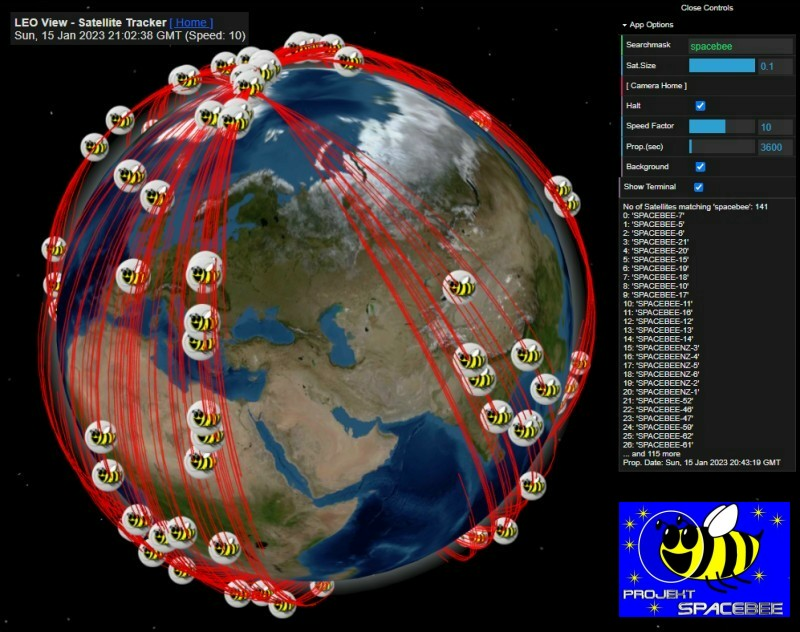
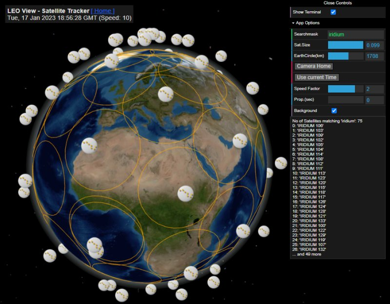

# LEO View - View LEO Satellites

JoEmbedded V0.4

LIVE: https://joembedded.github.io/LEO-Satellite-Viewer

Currently there are almost 7000 LEO Satellites (LEO stands 'Low-Earth-Orbit').
For a better understanding I wrote this little App. It is based on freely available and regularly updated real-time data (NORAD). 

Hints: 
- The 'Searchmask' also allows comma-separated list, like 'iss, tianping'
- 'Prop.(sec)' predicts the orbits for a number of seconds (typically the orbit of a LEO Satellite is arround 1.5h (ca. 5400 sec))
- The App accepts some URL parameters for customised display (see 'scripts.js' -> 'main')

## Some Satellite IoT operators:

_The Swarm network consists of ca. 150 'Spacebees', IoT based on 'LoRa'_
(Project Spacebee: https://github.com/joembedded/Spacebee )

_Astrocast (ca. 20 Satellites) has a very smart own IoT technology with extrem low power_

_Starlink just as additinal info (with ca. 3000 Satellites) for Broadband Internet)_

_The Iridium network (permanent global coverage), for IoT and Internet_

# Links
A project using the SWARM IoT Satellites: [Project Spacebee](https://github.com/joembedded/Spacebee)

# Sponsors
## This project was sponsered and supported by:

Link: [TerraTransfer GmbH, Bochum, Germany](https://www.terratransfer.org)

# *Kudos* to:
- The 'Three.js' library: https://threejs.org
- The 'Satellite.js' library: https://github.com/shashwatak/satellite-js
- CelesTrack for the NORAD data: https://celestrak.org
- Wael Yasmina for his excellent Tutorials: https://www.youtube.com/c/WaelYasmina
- 'Globe.gl' for inspiration: https://github.com/vasturiano/globe.gl
- 'Satellite Tracker' for inspiration: https://github.com/dsuarezv/satellite-tracker

***